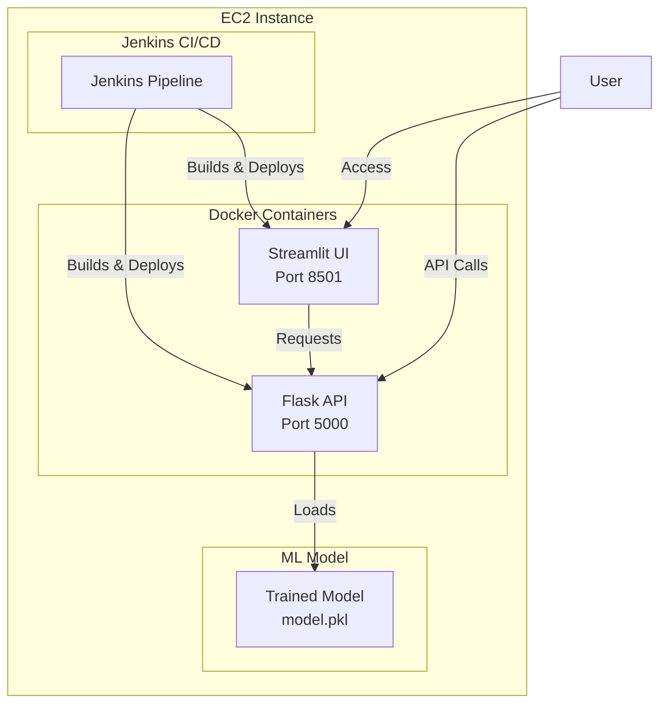
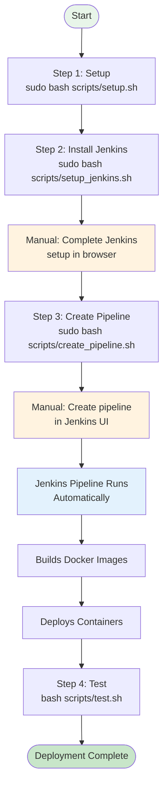
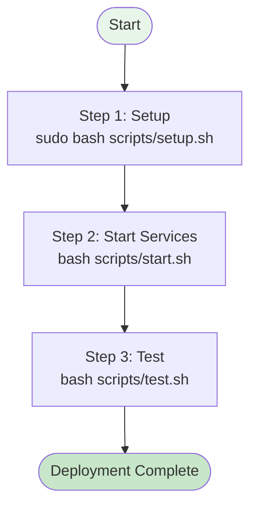
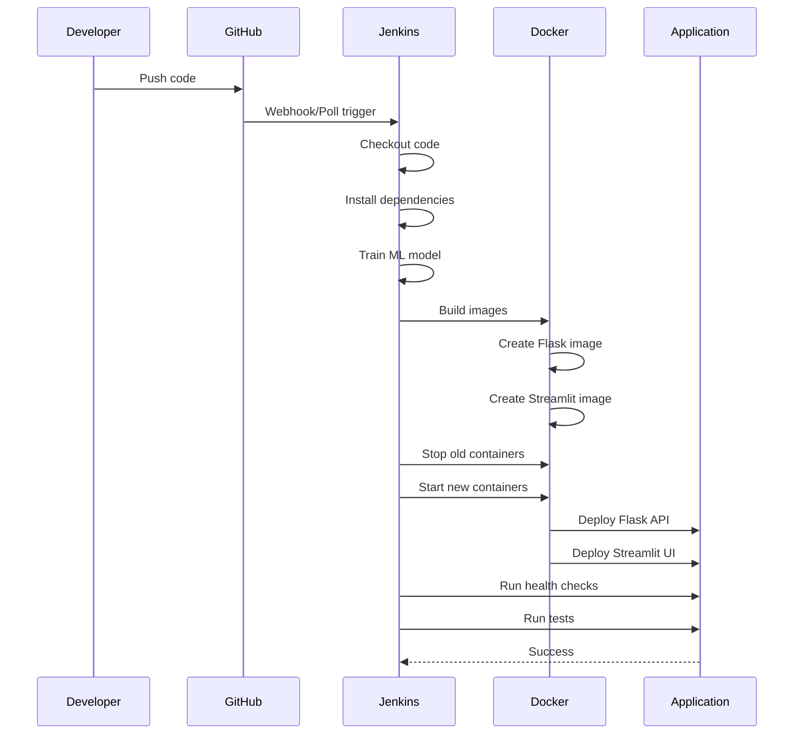

# MLOps Pipeline - Iris Flower Classification

Complete MLOps pipeline for deploying machine learning models on AWS EC2 with automated CI/CD using Jenkins.

## What This Does

Trains and deploys an Iris flower classification model with:
- **Flask REST API** for predictions
- **Streamlit Web UI** for interactive testing
- **Jenkins CI/CD** for automated deployment
- **Docker** for containerization

---

## Architecture



---

## Prerequisites

- Amazon Linux 2023 EC2 instance
- SSH access
- Security Group with ports open: 22, 5000, 8501, 8080

---

## Deployment Methods

### Method 1: Automated with Jenkins (Recommended)

Complete CI/CD pipeline that automatically builds and deploys everything.



#### Step 1: Initial Setup

```bash
# Clone repository
git clone https://github.com/JibbranAli/devops-project-7.1.git
cd devops-project-7.1

# Run setup (installs dependencies, trains model, builds images)
sudo bash scripts/setup.sh
```

**What this does:**
- Installs Python, Docker, Docker Compose
- Installs Python packages
- Trains ML model
- Builds Docker images

**Time:** 5 minutes

#### Step 2: Install Jenkins

```bash
sudo bash scripts/setup_jenkins.sh
```

**What this does:**
- Installs Java and Jenkins
- Starts Jenkins service
- Shows initial admin password

**Manual steps required:**
1. Open `http://YOUR-EC2-IP:8080` in browser
2. Paste the password shown in terminal
3. Click "Install suggested plugins"
4. Wait for plugins to install (5-10 minutes)
5. Create admin user or skip
6. Click "Start using Jenkins"

**Time:** 2 minutes + 10 minutes for plugins

#### Step 3: Create Pipeline

```bash
sudo bash scripts/create_pipeline.sh
```

**Manual steps required:**
1. In Jenkins, click **"New Item"**
2. Name: `mlops-pipeline`
3. Type: **Pipeline**
4. Click **OK**
5. Configure:
   - **Build Triggers**: Check "Poll SCM", Schedule: `H/5 * * * *`
   - **Pipeline**:
     - Definition: **Pipeline script from SCM**
     - SCM: **Git**
     - Repository URL: `https://github.com/JibbranAli/devops-project-7.1.git`
     - Branch: `*/main`
     - Script Path: `Jenkinsfile`
6. Click **Save**
7. Click **"Build Now"**

**What the pipeline does:**
- Pulls code from GitHub
- Installs dependencies
- Trains ML model
- Builds Docker images
- Stops old containers
- Deploys new containers
- Runs health checks
- Runs tests

**Time:** 2 minutes + 5 minutes for first build

#### Step 4: Test Deployment

```bash
bash scripts/test.sh
```

**What this does:**
- Verifies containers are running
- Tests API health
- Makes test prediction
- Confirms deployment success

**Time:** 1 minute

---

### Method 2: Manual Deployment

Deploy without Jenkins for simpler setup.



#### Step 1: Setup

```bash
# Clone repository
git clone https://github.com/JibbranAli/devops-project-7.1.git
cd devops-project-7.1

# Run setup
sudo bash scripts/setup.sh
```

#### Step 2: Start Services

```bash
bash scripts/start.sh
```

**What this does:**
- Starts Docker containers
- Launches Flask API
- Launches Streamlit UI

#### Step 3: Test

```bash
bash scripts/test.sh
```

---

## Access Your Application

After deployment:

- **Streamlit UI**: `http://YOUR-EC2-IP:8501`
- **Flask API**: `http://YOUR-EC2-IP:5000`
- **Jenkins**: `http://YOUR-EC2-IP:8080` (if installed)

Get your EC2 public IP:
```bash
curl http://169.254.169.254/latest/meta-data/public-ipv4
```

---

## Using the Application

### Web Interface (Streamlit)

1. Open `http://YOUR-EC2-IP:8501`
2. Adjust sliders for flower measurements
3. Click "Predict Flower Species"
4. See the result!

### API (Flask)

Make predictions via API:

```bash
curl -X POST http://YOUR-EC2-IP:5000/predict \
  -H "Content-Type: application/json" \
  -d '{
    "sepal_length": 5.1,
    "sepal_width": 3.5,
    "petal_length": 1.4,
    "petal_width": 0.2
  }'
```

Response:
```json
{
  "prediction": "Setosa",
  "prediction_id": 0,
  "confidence": 0.98
}
```

Check API health:
```bash
curl http://YOUR-EC2-IP:5000/health
```

---

## Pipeline Workflow



---

## Cleanup

Remove everything when done:

```bash
sudo bash scripts/cleanup.sh
```

**Interactive cleanup:**
- Removes Docker containers and images
- Optionally removes Jenkins
- Optionally removes Python packages
- Optionally removes Docker
- Optionally removes project directory

---

## Troubleshooting

### Containers not running

```bash
# Check status
docker-compose ps

# View logs
docker-compose logs

# Restart
docker-compose restart
```

### Model not found

```bash
# Train model
python3 app/train_model.py

# Verify
ls -lh app/model.pkl
```

### Can't access from browser

1. Check Security Group (ports 5000, 8501, 8080 open)
2. Use public IP (not localhost)
3. Check firewall:
```bash
sudo firewall-cmd --permanent --add-port=5000/tcp
sudo firewall-cmd --permanent --add-port=8501/tcp
sudo firewall-cmd --reload
```

### Jenkins pipeline fails

1. Check Jenkins console output
2. Verify Jenkins user in docker group:
```bash
sudo usermod -aG docker jenkins
sudo systemctl restart jenkins
```

---

## Project Structure

```
devops-project-7.1/
├── app/
│   ├── train_model.py       # ML model training
│   ├── flask_app.py          # REST API
│   └── streamlit_app.py      # Web UI
├── docker/
│   ├── Dockerfile.flask      # API container
│   └── Dockerfile.streamlit  # UI container
├── scripts/
│   ├── setup.sh              # Initial setup
│   ├── setup_jenkins.sh      # Jenkins installation
│   ├── create_pipeline.sh    # Pipeline creation
│   ├── start.sh              # Start services
│   ├── stop.sh               # Stop services
│   ├── test.sh               # Run tests
│   └── cleanup.sh            # Remove everything
├── docker-compose.yml        # Container orchestration
├── Jenkinsfile               # CI/CD pipeline
└── requirements.txt          # Python dependencies
```

---

## Technology Stack

- **Language**: Python 3.9
- **ML Library**: scikit-learn
- **API**: Flask
- **UI**: Streamlit
- **Containerization**: Docker
- **Orchestration**: Docker Compose
- **CI/CD**: Jenkins
- **Platform**: Amazon Linux 2023

---

## Quick Reference

| Command | Purpose |
|---------|---------|
| `sudo bash scripts/setup.sh` | Install dependencies, train model, build images |
| `sudo bash scripts/setup_jenkins.sh` | Install Jenkins |
| `sudo bash scripts/create_pipeline.sh` | Create Jenkins pipeline |
| `bash scripts/start.sh` | Start containers manually |
| `bash scripts/stop.sh` | Stop containers |
| `bash scripts/test.sh` | Test deployment |
| `sudo bash scripts/cleanup.sh` | Remove everything |

---

## Security Group Configuration

Make sure these ports are open in your EC2 Security Group:

| Port | Service | Required |
|------|---------|----------|
| 22 | SSH | Yes |
| 5000 | Flask API | Yes |
| 8501 | Streamlit UI | Yes |
| 8080 | Jenkins | Optional |

---

## License

MIT License
